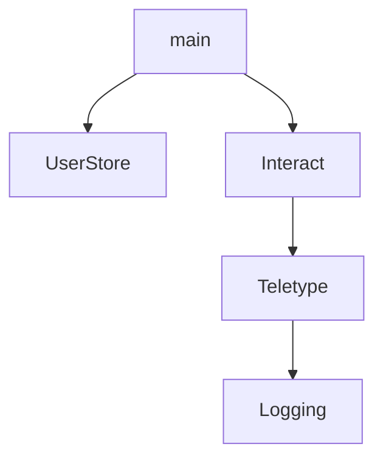

## cleff

The point of this repo is to serve as a playground for building with
`cleff`. `cleff` is an "effects" library for Haskell.

Haskell programmers are of course very familiar with the `IO` type,
which shows up any time you want to do something that has a side
effect. A Haskell's `main` function is an `IO` action, which gets run
by the "runtime". Because the IO type is the only one that Haskell
offers for side effects, every possible side effect is available to an
action that has an `IO` type. This is great when you are writing
`main`, but then if you want to write a test for `main`, you have a
problem. Because `IO` actions are opaque, there isn't really any way
to test that `main` works correctly besides trying to set up an
environment where it can do those side effects, running it and seeing
if the resulting state of the world was changed in the way we would
expect. Doing this can be very complicated -- an example is testing a
program that uses `getCurrentTime`, where we want to make sure that it
works correctly on, for example, leap days. Even if we find a way to
do this, we can't tell statically which kinds of side effects are
being used from which points in the program, so we run the risk of
missing a side effect somewhere in the program.

When writing a program using `cleff`, your effectful actions are no
longer in `IO`. Instead, they are in some monadic type which makes it
explicit which effects are being used. `cleff` provides some built-in
effects which do simple, foundational things like "return additional
side-channel information". You can define additional effects -- some
examples might be "have access to some settings" or "store User
records". With `cleff`, this might be expressed using a type signature
like `Eff '[GetSettings, StoreUser] SomeResult`[*], where `GetSettings` and
`StoreUser` might be effects that we have designed.

[*] You will instead typically see a type signature that looks more
like `(GetSettings :> es, StoreUser :> es) => Eff es SomeResult`, meaning
"this thing works with any set of effects that has _at least_
`GetSettings` and `StoreUser`. This makes it easier to compose actions that
use different sets of effects, since the effects can just be added
together.

So then you have such an action that uses a bunch of effects. We then
are able to "interpret" the effects in different ways. For example, we
might have an implementation of the `StoreUser` effect that we use in
production, which actually writes to a database, but in testing we
might simply capture the stored users and examine them later. `cleff`
gives us lots of tools to provide implementations of effects. Each
implementation removes an effect from the action until you get to
either no effects (in which case you have a pure computation) or just
the IO effect (in which case you can convert to an `IO` action, say to
use it in `main`).

This is a powerful mechanism that can be used to express
"capabilities" and can be helpful in structuring your program into
smaller systems. It can also serve as a dependency-injection
mechanism. In both cases, the goal is that having your program be
explicit about what effects it uses makes it easier to see what is
being used, provide limits on things that shouldn't be used, and
separate interfaces from implementations. You may be used to using
monad transformers to achieve these kinds of goals.

## Architecture

The goal of this project is to try to experiment with techniques to
build complicated systems from modular, composable parts. To that end,
we need some kind of system which we can try to build, with
clearly-defined parts that make sense on their own, and then to try to
combine them. I was aiming for a system that looks, conceptually, like
this:



The components are:

- Logging. This system is responsible for accepting
  messages to log, and then presumably to recording them somehow.

- Teletype. This system provides low-level access to a terminal and
  lets you write messages to a user or read text that the user
  typed. (This is inspired by the example in the cleff README, and
  served as the inspiration for the example program.)

- Interact. This system provides higher-level access to a
  terminal. The operations here have semantics that are more clearly
  tied to interacting with a user, with a typical operation being to
  prompt the user for some input and then to read the input.

- UserStore. This system provides a concept of persistence, with
  operations being to look up a user (using their name as the primary
  key) or to store a user (which potentially replaces an existing user
  with the same name).

For our purposes, we model each component as a `cleff` "effect".

## Prerequisites

Using cleff requires a handful of GHC extensions. Some of these
introduce new syntax or other constructs that might be
unfamiliar. Here we will cover some of them. Feel free to skip this
section if you are already conversant with all of these extensions.

### GADTs

[GADTs](https://downloads.haskell.org/ghc/latest/docs/users_guide/exts/gadt.html)
introduce two new things, one syntactic and one semantic. The
syntactic one is a new way to define `data` types. If we think about
the classic `Maybe` type, we typically see it defined like this:

```haskell
data Maybe a = Nothing | Just a
```

This introduces a `Nothing` constructor, which is nullary (that is,
it's already a `Maybe a`) and a `Just` constructor, which takes an `a`
(that is, `Just a` is a `Maybe a`, or equivalently, `Just :: a ->
Maybe a`). With [GADT
syntax](https://downloads.haskell.org/ghc/latest/docs/users_guide/exts/gadt_syntax.html#gadt-style),
we can also write this as:

```haskell
data Maybe a where
  Nothing :: Maybe a
  Just :: a -> Maybe a
```

You might observe that the syntax here is much like a normal function
signature, but for each data constructor. We'll come back to this idea
in the [guided tour](guided-tour.md).

This syntax is a little clunky for most of the data types we use in
Haskell, because we end up restating that these constructors all
produce `Maybe a` in each case. Of course they do, they are all
constructors of the same type!

`cleff` effects are always defined with this syntax so it's good to be
familiar with it. The semantic thing is a little less important from
the perspective of someone trying to use `cleff`, but it is an
important part of how `cleff` works so we'll touch on it a little bit
here.

The semantic thing that GADTs adds is that it's possible for different
constructors to have different types. For example, let's say we're
defining a small calculator. We can define a type of expressions:

```haskell
data Expr a where
  LiteralInt :: Int -> Expr Int
  LiteralBool :: Bool -> Expr Bool
  AddExpr :: Expr Int -> Expr Int -> Expr Int
```

In this example, we have `Expr a`, with the `a` indicating the type
that we would get if we were to evaluate the expression. Here we are
able to indicate that integer literals produce integer expressions,
and that addition produces an integer expression.

With GADTs, the compiler can use information about the type to infer
which constructors are possible. For example, you can write this
function:

```haskell
evaluate :: Expr Int -> Int
evaluate e = case e of
  LiteralInt i -> i
  AddExpr e1 e2 -> (evaluate e1) + (evaluate e2)
```

Here, the compiler knows that if we have an `Expr Int`, we can't have
a `LiteralBool`, so we don't even have to consider it in our pattern
match.

You might contrast this with another approach you might be familiar
with, with phantom types. Without GADTs, we could write:

```haskell
data Expr a = LiteralInt Int | LiteralBool Bool | AddExpr (Expr Int) (Expr Int)
```

Here we have some unfortunate properties. Because there's nothing that
ties the type of the `a` variable to the types of the constructors,
GHC will let us choose any `a`. For example, this compiles, even
though we would rather it not:

```haskell
x :: Expr String
x = LiteralBool True
```

We can get around this a little bit by wrapping the constructors to
enforce the types we want to see:

```haskell
literalInt :: Int -> Expr Int
literalInt i = LiteralInt i

literalBool :: Bool -> Expr Bool
literalBool b = LiteralBool b

addExpr :: Expr Int -> Expr Int -> Expr Int
addExpr e1 e2 = AddExpr e1 e2
```

However, with this approach, the compiler is naive about what
constructors can occur in what types. So if we want to write the
equivalent of our `evaluate` function, we have to do something like
this:

```haskell
evaluate :: Expr Int -> Int
evaluate e = case e of
  LiteralInt i -> i
  AddExpr e1 e2 -> (evaluate e1) + (evaluate e2)
  LiteralBool b -> error "shouldn't happen??"
```

... and without the case for `LiteralBool`, the compiler will refuse to work.


### DataKinds

The `DataKinds` extension blurs the distinction between types and
values.  This is usually in service of type-level programming. With
`DataKinds` you can do stuff like this:

```haskell
f :: Maybe 'True
```

This would normally be impossible, because `True` isn't a type, it's a
value (of a type called `Bool`).

`DataKinds` lets you "promote" values to types using a tick (the `'`
character). In some circumstances, GHC is smart enough to figure out
what's going on without the tick, but there is a syntactic ambiguity
that means that in one specific case, it's required[*], so we will
endeavor to include it throughout our code here. However, in the wild,
you may see code where it is left off.

`cleff` uses this in the service of building types that include
information about all the effects being used by a function. We will be
modeling each "system" as a `cleff` effect. So if you use an
`Interact` effect and a `UserStore` effect, your function might be:

```haskell
f :: Eff '[Interact, UserStore] ()
```

Here, we use DataKinds to use a literal list, which would normally
be a value, at the type level.

[*] We're trying to write code that has a type-level list of elements,
where each element refers to a single effect. For something like `[]`,
this is clearly the empty list, and `[Effect1, Effect2]` is clearly a
type-level list. But writing `[Int]` traditionally means "a list of
`Int` values". If you want a type-level list containing only a single
element, you must use the tick to remove the ambiguity. Since this is
kind of a weird edge case that can produce weird type errors, we
choose to always use the tick when writing type-level lists.

### TypeOperators

In order to work with these type-level lists, we want to use the `:`
operator to attach (and also destructure) individual effects. For
this, we need another extension, `TypeOperators`, which lets us use
operators at the type level. So you might have a type that does
something like this:

```haskell
ignoreLogs :: Eff (Logging : es) a -> Eff es a
```

This function accepts an action that has an arbitrary set of effects,
where the "first" effect is `Logging`, and it "removes" it from the
set of effects used by the function.
